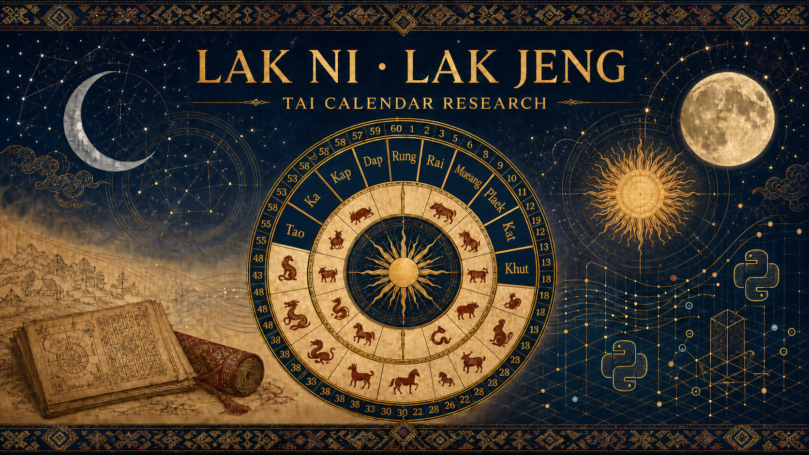

 🇬🇧 [English](README.md) | 🟨🟩🟥 [Shan / Tai](README_SHN.md) | 🇲🇲 [မြန်မာ](README_MY.md)| 🇹🇭 [ภาษาไทย](README_TH.md)

# Lak Ni & Lak Jeng — Tai Calendar Algorithms in Python

<p align="center">
  
</p>

A hands-on research toolkit for the **sexagenary ("60-name") calendar** used by the Tai
peoples — including the **Tai Ahom** of Assam, India (who call it *Lak Ni* / *Lakni*) and
the **Shan** of Myanmar (whose hand-calculation method is known as *Lak Jeng*).

Two independent implementations are provided, each following a different documented
tradition, plus a test suite that proves they agree with each other and with published
reference data:

| Script | Tradition followed | Method |
|---|---|---|
| `lak_ni.py` | Tai Ahom *Lak Ni* (Assam) | Modular arithmetic on Julian Day Numbers |
| `lak_jeng.py` | Shan *Lak Jeng* (Myanmar/Yunnan) | Sūrya Siddhānta integer day-count (*ahargaṇa*) |
| `sakkaraj.py` | Chula Sakarat / Thet Kayit era machinery | Myanmar watat rules + Thai avoman integers |

Companion research notes: [**`SAKKARAJ.md`**](SAKKARAJ.md) — deep dive into the Sakkaraj era family
(Anjana 691 BCE → Buddha 544 BCE → Śaka/Mahā 78 CE → **Cula Sakarat 22 March 638 CE**),
the Makaranta→Thandeikta→Advisory-Board calculation eras, watat intercalation logic,
regional month-numbering hazards, and the Thai/Burmese leap-day placement difference.

No third-party dependencies — Python 3 standard library only.

---

## Table of contents

1. [Background: one cycle to rule them all](#1-background-one-cycle-to-rule-them-all)
2. [The 10 Mothers and 12 Children](#2-the-10-mothers-and-12-children)
3. [Quick start](#3-quick-start)
4. [Algorithm A — Lak Ni year cycle](#4-algorithm-a--lak-ni-year-cycle)
5. [Algorithm B — the shared 60-day cycle](#5-algorithm-b--the-shared-60-day-cycle)
6. [Algorithm C — lunar phase, Myanmar style](#6-algorithm-c--lunar-phase-myanmar-style)
7. [Algorithm D — the Lak Jeng ahargaṇa, step by step](#7-algorithm-d--the-lak-jeng-ahargana-step-by-step)
8. [How everything was verified](#8-how-everything-was-verified)
9. [Known discrepancies and open questions](#9-known-discrepancies-and-open-questions)
10. [Glossary](#10-glossary)
11. [References](#11-references)

---

## 1. Background: one cycle to rule them all

The Tai calendar family descends from the Chinese **ganzhi (干支)** system: two counters,
one of length 10 ("Mothers" / heavenly stems) and one of length 12 ("Children" /
earthly branches / zodiac animals), advanced in lockstep. Because lcm(10, 12) = **60**,
exactly 60 distinct name-pairs exist before the sequence repeats:

```
Kra-Jai, Lup-Pao, Hai-Khan, Muang-Mao, Puek-Si, ...
... Tao-Hao, Ka-Set, Kra-Jai  ← repeats after 60 steps
```

The same 60 names are reused for **years**, **days**, and even **months/hours**
depending on the community. Crucially, the *day* cycle is one single unbroken count
shared across Chinese, Shan, Dai, Lue, Khün, and Ahom traditions — there is only one
correct alignment, not one per ethnic group.

What *does* differ between communities is:

- the **epoch** (which historical year is "year 1"),
- the **new-year boundary** (early December? April Thingyan? lunar New Year?),
- **spelling** (Kut = Kud = Kat; Kwai = Kai; Möng = Muang ...),
- the **lunar arithmetic** used to build actual months.

This repository implements two of those traditions and makes the differences explicit.

---

## 2. The 10 Mothers and 12 Children

Spelling varies wildly between sources; positions do **not**.
All of the following are the *same position* in the cycle:

| # | Mother (element) | Ahom/Shan spellings seen | | # | Child (animal) | Spellings seen |
|---|---|---|---|---|---|---|
| 0 | wood | Kra, Kap, Kha, Karp | | 0 | rat | Jai, Chai, Choad |
| 1 | fire | Lup, Lap | | 1 | ox | Pao, Ngok, Chalu |
| 2 | earth | Hut, Hot, Hai | | 2 | tiger | Khan, Yee, Kharn |
| 3 | metal | Muang, Mong, Möng, Mvng | | 3 | hare | Mao, Tho |
| 4 | water | Puek, Pok, Pök | | 4 | dragon/naga | Si |
| 5 | wood | Kut, Kud, Kat | | 5 | snake | Sai |
| 6 | fire | Koat, Kwat, Khot | | 6 | horse | Singa, Nga, Si-nga |
| 7 | earth | Hong, Hung, Hvng, Hoong | | 7 | goat | Met, Mot, Med |
| 8 | metal | Tao, Thao, Tv | | 8 | monkey | San, Saan, Wok |
| 9 | water | Ka, Kap, Kaap | | 9 | cock | Hao, Rao, Raga |
| | | | | 10 | dog | Set, Sed, Jaw |
| | | | | 11 | pig | Kai, Kwai, Goon |

> Note the element pattern: wood, fire, earth, metal, water, then repeat —
> *each element appears twice per decade*, once "male" and once "female".
> This is the **Tai** distribution. The Chinese stem-element pairing is laid out
> differently (wood, wood, fire, fire, ...), so a Tai element does **not** map
> 1-to-1 onto a Chinese stem at the same index — but the animal always agrees.

### Two competing stem-name tables (important!)

Comparative research across Vietnam/Laos/Thailand/India reveals **two attested
name-sets** for the same ten positions:

| # | Shan/Lanna set (`lak_jeng.py`, verified) | Ahom/Buranji set (`lak_ni.py` default) | Chinese stem |
|---|---|---|---|
| 0 | Kra/Kap | Kap | 甲 jiǎ (wood yang) |
| 1 | Lup/Lap | Dap | 乙 yǐ (wood yin) |
| 2 | Hut/Hai | Rai | 丙 bǐng (fire yang) |
| 3 | Muang/Möng | Mueang | 丁 dīng (fire yin) |
| 4 | Puek/Pök | Plaek | 戊 wù (earth yang) |
| 5 | Kut/Kud | Kat | 己 jǐ (earth yin) |
| 6 | Koat/Khot | Khut | 庚 gēng (metal yang) |
| 7 | Hong/Hung | Rung | 辛 xīn (metal yin) |
| 8 | Tao/Thao | Tao | 壬 rén (water yang) |
| 9 | Ka | Ka | 癸 guǐ (water yin) |

The Ahom set maps **element-for-element onto the Chinese stems**; the Shan set carries
the indigenous five-element×2 doctrine instead. Positions 0, 3, 5, 8, 9 are near-identical
in both sets (Kap≈Kra, Mueang≈Muang, Kat≈Kut, Tao, Ka) — likely dialect drift of one
ancient word-list. `lak_ni.py` reports the Ahom naming as primary (Buranji evidence:
"Lakni Rung-rao" = 辛酉 metal-rooster; the popular year lists cycle through *dap, rai,
khut, rung*), with the Shan variant shown alongside.

---

## 3. Quick start

```bash
cd lak_ni_research

python3 lak_ni.py                     # today: full Lak-Ni report
python3 lak_ni.py 2026 08 23          # specific Gregorian date
python3 lak_ni.py --tz 5.5            # Assam time instead of Myanmar time
python3 lak_ni.py --test              # run self-tests

python3 lak_jeng.py 2115              # full Lak Jeng calculation for Tai Year 2115
python3 lak_jeng.py --date 2026 8 23  # day cycle via the Gregorian bridge
python3 lak_jeng.py --test            # self-tests + 1827-day cross-check vs lak_ni
```

Sample output (`lak_ni.py 2026 08 23`):

```
Gregorian date : 2026-08-23 (Sun)
Tai year       : 2026 (turns songkran)
Lak-Ni year    : 54/60 "Khutchi" (folk Me-Pi count, anchored 1193 CE)
Year name      : Rai-Singa = fire horse  [Rai (bing 丙) x Singa/Nga (horse)]
Shan variant   : Hut/Hai-Singa
Sakkaraj era   : 1388 CS (sok 8 = atthasok)
Day name       : Kut-Sai  (5/60) [Kut x Sai (snake)]
Lunar phase    : waxing day 10  [UTC+6.5, Myanmar-style]
Julian Day No. : 2461276
```

---

## 4. Algorithm A — Lak Ni year cycle

### Step 1 — pick your anchor

The popular Ahom tradition counts years from **1193 CE = "Mungkeu"**, the birth year of
Sukaphaa, founder of the Ahom kingdom. This anchor is verifiable from published lists:

| Event | AD year | Lak-Ni position | Name |
|---|---|---|---|
| Sukaphaa born | 1193 | 1 | Mungkeu |
| Journey to Assam begins | 1215 | 23 | Katrau |
| Kingdom founded (Charaideo) | 1253 | 61 ≡ 1 | Mungkeu again ✓ |
| Sukaphaa dies | 1268 | 16 | Taoni |

### Step 2 — position in the cycle

```
n = ((AD_year − 1193) mod 60) + 1        # 1-based position in the 60-year Me-Pi cycle
name = ME_PI_60[n]                       # e.g. n=54 → "Khutchi"
```

Worked: 2026 → (2026−1193) = 833 → 833 mod 60 = 53 → n = 54 → **Khutchi**, cycle 14.
⚠️ This folk numbering is anchored to Ahom history (Sukaphaa). It is a *separate*
counting tradition from the pan-Tai China-aligned names below — do not mix them.

### Step 3 — structural decomposition (pan-Tai alignment)

The pan-Tai name pair uses the classic ganzhi epoch: **4 CE = kap-chai (甲子)**,
so `(Y − 4)` replaces the Chinese `(Y − 4)` identically (our earlier constant
1984 ≡ 4 mod 10/12/60 gives identical indices):

```
stem_index   = (AD_year − 4) mod 10      # 2026 → 2 → Rai (丙 fire)
animal_index = (AD_year − 4) mod 12      # 2026 → 6 → Singa/Nga (horse)
cycle_index  = (AD_year − 4) mod 60      # 2026 → 42 (43rd term, bǐngwǔ 丙午)
```

→ **2026 = Rai-Singa, the Fire-Horse year** (Chinese Bǐng-wǔ ✓).
2025 = Dap-Sai / 乙巳 = Wood Snake (a circulating comparative table mislabels it
"Water Snake"; 乙 is wood-yin).

**Year-turn rule (critical for dates!):** the Tai/Ahom year turns around
**mid-April** (Bohag Bihu / Sangken / Songkran season), not January 1 — so
Jan 1–Apr 13, 2026 still belongs to the *Wood-Snake* year. Chinese-style usage
turns at Lìchūn (~Feb 4). `lak_ni.py --boundary {songkran,lichun,jan1}`
(default songkran, Apr 14) applies this before all year arithmetic.

### Step 3b — the Thai *sok* offset trap

Central Thailand officially replaces the stem wheel with the ***sok***: the last
digit of the Chula Sakarat year, `CS = Y − 638`. It sits a fixed −4 from the
kap–ka index: `sok = (Y − 638) mod 10`. 2026 → CS 1388 → digit 8 → *atthasok* →
"Year of the Horse, atthasok". Same engine, different decade-name wheel — the #1
source of "my stem doesn't match" confusion when comparing almanacs.

**Animal substitutions by culture:** Ox→water-buffalo (Vietnam), Rabbit→cat
(Vietnam), Dragon→Naga/Nak (Lao/Thai), Pig→elephant (parts of Lanna); Khmer
communities often run one animal ahead of Lao reckoning (+1 offset).

### Step 4 — auxiliary eras

```
Sakkaraj (Chula Sakarat): CS = AD_year − 638
Buddhist Era (Thai):      BE = AD_year + 543   (Myanmar/Ceylon use +544)
Great Dai era:            T  ≈ AD_year + 95    (epoch 95 BCE, see lak_jeng)
```

---

## 5. Algorithm B — the shared 60-day cycle

Both scripts implement this identically (verified daily over 5 years).

### Step 1 — Julian Day Number

```
a  = floor((14 − month)/12);  y = year + 4800 − a;  m = month + 12a − 3
JDN = day + floor((153m+2)/5) + 365y + floor(y/4) − floor(y/100) + floor(y/400) − 32045
```

Check: 2000-01-01 → 2451545.

### Step 2 — anchor to the continuous count

The count is calibrated with a rock-solid published fact: **1949-10-01 was a jiazi
(甲子 / Kap-Jai / Kra-Jai) day**, JDN 2433191.

```
index = (JDN − 2433191) mod 60       # 0 = Kra-Jai / Kap-Jai
mother = MOTHERS[index mod 10]
child  = ANIMALS[index mod 12]
weekday = ordinary 7-day week (independent of this cycle)
```

Example: 2026-08-23 → (2461276 − 2433191) mod 60 = **5** → Kut/Kat-Sai (snake day).

If your community's almanac ever disagrees, solve for its private offset instead of
editing the anchor:

```bash
python3 lak_ni.py --calibrate YYYY-MM-DD AnimalName   # prints candidate anchors
```

---

## 6. Algorithm C — lunar phase, Myanmar style

`lak_ni.py` labels each date with the traditional fortnight-day, using three rules
learned the hard way (see §8, check 4):

**Rule 1 — use TRUE new moons, not a mean synodic month.**
Meeus' low-precision series (`true_new_moon_jde(k)` in the code) reproduces the
canonical 2000-01-06 18:14 UT conjunction exactly and stays within ~±1 minute for
modern epochs.

**Rule 2 — the conjunction day CLOSES the old month.**
This is explicit in both source traditions:

> *"The new moon day is the last day of the month"* — cool-emerald (Myanmar), §7.2

So map the conjunction instant into local civil time, and that civil day is
*new-moon day*; **waxing day 1 is the NEXT day.**

```
conj_local_JD = JDE_conjunction + tz_hours/24
conj_day      = floor(conj_local_JD + 0.5)      # civil day containing conjunction
delta         = date_JDN − conj_day

delta = 0        → new-moon day (last day of old month)
1 ≤ delta ≤ 14   → waxing day delta
delta = 15       → FULL MOON day
delta ≥ 16       → waning day (delta − 15)
```

**Rule 3 — timezone matters, legitimately.**

Real case, August 2026 — conjunction at **Aug 12, 17:37 UT**:

| Zone | Local conjunction | Conjunction day | 2026-08-23 is |
|---|---|---|---|
| UTC+6:30 (Myanmar) | Aug 13, 00:07 | Aug 13 | **waxing day 10** |
| UTC+5:30 (Assam)   | Aug 12, 23:07 | Aug 12 | waxing day 11 |

The instant fell within ~35 minutes of Myanmar midnight, so calendars anchored in
adjacent zones disagree by one day *by construction*, not by error.
Default is `--tz 6.5`; pass `--tz 5.5` for an Ahom/Assam reading.

Sanity anchor: Tai New Year 2116 = Sunday **2021-12-05 = waxing day 1** (conjunction
Dec 4) — consistent with both the Shan source document and the Myanmar rule.

---

## 7. Algorithm D — the Lak Jeng ahargaṇa, step by step

`lak_jeng.py` follows the Shan prose procedure ("Method for Calculating the Lak Jeng
Cycle", Süa Tai Möng, 2021), which needs no Gregorian tables — just integers. Its
constants encode the **Sūrya Siddhānta** mean sidereal year:

```
1577917828 civil days / 4320000 years = 365.258756481481… d
≈ 292207/800 (= 365.25875)  +  7/(1350·800)  (correction restores 28 days/mahāyuga)
```

Given a **Tai year T**:

```
Step 1  Y = T − 1                                   (calculation year)

Step 2  q = floor(Y/1350);  r = Y mod 1350
        C = 7q + floor(r/193)                       (slow-correction counter)
        N = 292207·Y + C + 6869                     (day numerator, epoch 6869)

Step 3  Q = floor(N/800);  R = N mod 800             (R = "old day position",
        A = Q + 1 if R > 0 else Q                     800−R = "new day position")
                                                      A = elapsed days = ahargaṇa

Step 4  M = 11·A − floor(Y/25) + 420                 ("missing days", tithi drift)
        D = floor(M/692);  P = M mod 692

Step 5  L = floor((A+D)/30);  d = (A+D) mod 30       (completed lunar months,
                                                      day-within-month)

Step 6  weekday = A mod 7                            (1=Sun … 6=Fri, 0=Sat)

Step 7  day index g = (A + 2) mod 60                 (0 = Kap-Jai)
        day mother = MOTHERS[g mod 10];  day child = CHILDREN[g mod 12]

Step 8  year mother = MOTHERS[(Y + 3) mod 10]        (≡ (Y+4) mod 10, 1-based)
        year child  = CHILDREN[(Y − 1) mod 12]       (≡ Y mod 12, 1-based)
```

### Worked example — Tai Year 2115 (reproduced exactly by `lak_jeng.py 2115`)

```
Y = 2114
C = 7·1 + floor(764/193) = 7 + 3 = 10
N = 292207·2114 + 10 + 6869 = 617,732,477
Q = 772,165, R = 477  →  A = 772,166
M = 11·772166 − 84 + 420 = 8,494,162  →  D = 12,274, P = 554
A + D = 784,440 = 30 × 26,148 + 0     →  26,148 lunar months, position 0
772,166 mod 7 = 3                      →  Tuesday
(A+2) mod 60 = 28 → Tao + Si           →  "Tao Si"
year: Hung + Pao                        →  "Hung Pao"
```

### Bridging to Gregorian dates

The source pins one dated pair: **Tai NY 2116 = Sunday 2021-12-05 with A = 772,521**.
Since consecutive civil days increment A by 1:

```
A(date) = 772521 + (JDN(date) − 2459554)
```

That bridge is what `lak_jeng.py --date` uses, and it is how the two scripts were
cross-checked against each other (§8). For the Tai-era number of a Gregorian date,
the script computes the true **Nadaw waxing-1** (see below).

### Tai New Year & the Shan month system (per Pakpi&TaiCalendar App)

The Tai/Shan year does **not** turn at Thingyan/Songkran (April) — it has its own
month wheel. Verified against the decompiled `ShanDate.java`:

```
Shan month = Myanmar month + 4   (mod 12)
→ Shan month 1 = Nadaw (MM 9); Shan months run Nadaw(1) … Tabaung(4), Tagu(5) … Waso(12)

Shan year = Myanmar year + 733   for MM months 9–12  (Shan months 1–4)
          = Myanmar year + 732   for MM months 1–8   (Shan months 5–12)
```

So the Tai year turns at **first waxing of Nadaw** — the *Margasirsa* new moon in
late November/mid December. `lak_jeng.py` locates it astronomically (true new moon,
Myanmar timezone, latest conjunction in Nov 15–Dec 31) instead of a fixed date:

| Anchor | Date | Check |
|---|---|---|
| Tai NY 2116 | Sun **2021-12-05** | = Lak-Jeng README anchor; A = 772,521 ✓ |
| Tai NY 2120 | **2025-12-21** | day name = Kap-Jai (cycle position 0!) |
| today 2026-08-23 | Tai year **2120** | matches community usage ✓ |
| next NY (2121) | 2026-12-10 | computed |

The app also confirms our day-cycle alignment algebraically: its
`(epochDay+7) mod 10 / (epochDay+5) mod 12` differs from `(JDN − 2433191) mod 60`
by constants divisible by 10, 12 — identical count. Its market-day rule
(`mePee ∈ {2,7}` = ဝၼ်းၵၢတ်ႇမိူင်း) rides the same stem wheel; `lak_jeng.py --date`
now reports it.

### The app's `WanTai60` day name = our shared cycle (verified)

`ShanDate.getWannTai60(epochDay)` names each civil day with the Shan List-A set:

```java
mePeeInt  = (|epochDay| + 7) % 10   // Kap, Lap, Hai, Möng, Pok, Kat, Khut, Hung, Tao, Ka
lukPeeInt = (|epochDay| + 5) % 12   // Jai, Pao, Yi, Mao, Si, Sai, Singa, Mot, San, Hao, Met, Kwai
```

Since `JDN = epochDay + 2440588`, the constants differ from ours by exactly
`7390 = 739×10` and `7392 = 616×12` — so all three implementations in this repo
produce the **same continuous cycle**. Empirically: 1,827 consecutive days
(2023–2027) show zero positional mismatches against `lak_ni.py` and
`lak_jeng.py`; the only differences are romanization (`Khut` vs `Khot/Koat`
at stem position #6). Spot checks: 1970-01-01 → Hung-Sai; 2000-01-01 →
Pok(Puek)-Singa; 2026-08-23 → Kat(Kut)-Sai.

### Shan-script names (from Pakpi&TaiCalendar App)

The canonical Shan script arrays used by both `lak_ni.py` and `lak_jeng.py`
(positionally aligned with every romanization table above):

**MePee / Mothers (10)**

| # | Roman | Shan | | # | Roman | Shan |
|---|---|---|---|---|---|---|
| 0 | Kap/Kra | ၵၢပ်ႇ | | 5 | Kat/Kut | ၵတ်း |
| 1 | Lap/Lup | လပ်း | | 6 | Khut/Koat | ၶုတ်း |
| 2 | Hai/Hut | ႁၢႆး | | 7 | Hung/Hong | ႁုင်ႉ |
| 3 | Möng/Muang | မိူင်း | | 8 | Tao | တဝ်ႇ |
| 4 | Pok/Puek | ပိုၵ်း | | 9 | Ka | ၵႃႇ |

**LukPee / Children (12)**

| # | Roman | Shan | | # | Roman | Shan |
|---|---|---|---|---|---|---|
| 0 | Jai (rat) | ၸႂ်ႉ | | 6 | Singa (horse) | သီင |
| 1 | Pao (ox) | ပဝ်ႉ | | 7 | Mot (goat) | မူတ်ႉ |
| 2 | Yi (tiger) | ယီး | | 8 | San (monkey) | သၼ် |
| 3 | Mao (hare) | မဝ်ႉ | | 9 | Hao (cock) | ႁဝ်ႉ |
| 4 | Si (naga) | သီ | | 10 | Met (dog) | မဵတ်ႉ |
| 5 | Sai (snake) | သႂ်ႉ | | 11 | Kwai (pig) | ၵႂ်ႉ |

Both scripts print these: `lak_jeng.py` renders day cycles as
`Tao Si / တဝ်ႇသီ` (matching the source document), and `lak_ni.py` adds a
"Day in Shan" line (e.g., today → `ၵတ်းသႂ်ႉ`). Regression tests pin
today's pair as (`ၵတ်း`, `သႂ်ႉ`) in both files.

#### ⚠️ Bug found in the app 🐛

`Math.abs(epochDay)` **mirrors dates before 1970** instead of counting backwards.
Example: for **1969-12-31** the phone would display *Tao-Singa*, but the true
shared count says **Khot-Si (庚辰)**. Only dates ≥ 1970-01-01 are affected.
Our Python uses proper negative modulo and stays correct across the 1970
boundary. If you ever port `WanTai60` elsewhere, **drop the `abs()`**:

```python
mi = (epoch_day + 7) % 10     # no abs()!
li = (epoch_day + 5) % 12
```

---

## 8. How everything was verified

Run both suites anytime:

```bash
python3 lak_ni.py --test && python3 lak_jeng.py --test
```

| Check | Reference | Result |
|---|---|---|
| Me-Pi anchors 1193/1215/1253/1268 | published Ahom year list | pass |
| Pan-Tai animal: 1984 = rat | Chinese zodiac equivalence | pass |
| JDN formula | 2000-01-01 = 2451545 | pass |
| Day cycle anchor | 1949-10-01 = jiazi (Kap-Jai) | pass |
| True new moon, k=0 | 2000-01-06 18:14 UT | exact |
| True new moon, Dec 2021 | solar-eclipse conjunction 07:43 UT | ±1 min |
| Tai NY 2116 = 2021-12-05 | waxing day 1, Sunday, A=772,521 | pass |
| Lak Jeng worked example T=2115 | every intermediate integer | pass |
| lak_ni ↔ lak_jeng agreement | 1,827 consecutive days (2023–2027), cycle index + weekday | pass |
| 2026-08-23 lunar label | Myanmar calendar shows waxing 10 | reproduced (UTC+6:30) |
| Today's day name | user's community almanac "Kut Sai" | reproduced (index 5) |

---

## 9. Known discrepancies and open questions

Honest limitations you should know before citing this code:

1. **The Lak Jeng source disagrees with itself by 10 days.** Its own formula applied to
   T=2116 yields A = 772,531, but its update text states 772,521 for that new year.
   We implement the formula faithfully and use the dated pair as the Gregorian bridge.
   The README of the source admits the epoch offsets (6,869 and 420) are underived.

2. **`ME_PI_60` (the 60 Ahom year names) comes from popular transliterated sources** and
   contains inconsistencies (e.g., "Dapcheu" appears twice, marked `*`). For scholarly
   work, replace it with the Me Pi table in Terwiel & Ranoo (1992), p. 91
   (columns Lakni / Kham Mvng / Pi Han / Pi Pan).

3. **Era boundaries differ by design**: Ahom Lak-Ni flips at the Sakkaraj-linked new year;
   Shan/Great-Dai flips in early December; Myanmar months flip around April (Thingyan).
   Do not compare era *numbers* across systems without converting first — but the
   60-*names* of days agree everywhere (that's the point of §5).

4. **ΔT ignored**: Meeus JDE is in Dynamical Time; Earth-rotation lag is ~69 s in 2026 —
   irrelevant at day resolution unless a conjunction falls within seconds of midnight.

5. **Element mapping caveat** (§2): Tai element ≠ Chinese stem at equal index.
   `lak_ni.py` reports Tai elements only.

---

## 10. Glossary

| Term | Meaning |
|---|---|
| **Lak Ni / Lakni** | "calendar"; the Tai Ahom sexagenary system (years & days) |
| **Lak Jeng** | Shan hand-calculation procedure for the same cycle (this repo's algorithm D) |
| **Me-Pi / Mae-Pi** | "Mother years" — the 10-element cycle (stems) |
| **Look-Pi / Son years** | The 12-animal cycle (branches) |
| **ahargaṇa (A)** | Elapsed civil-day count from an epoch (Indian astronomical term) |
| **tithi** | 1/30 of a synodic month; source of the "missing day" correction |
| **watat** | Burmese leap year (intercalary month); "big watat" also adds a day |
| **Sakkaraj / CS** | Chula Sakarat era = AD − 638, used across mainland SE Asia |
| **jdn / JDE** | Julian Day Number (integer days) / Julian Ephemeris Date (with time) |
| **Oo/Hnaung Tagu** | Early/Late Tagu — Myanmar month straddling the new year |
| **Thingyan akya/atat** | New-Year festival boundary times in the Myanmar calendar |

---

## 11. References

**Primary sources for the algorithms**

1. Süa Tai Möng, "Method for Calculating the Lak Jeng Cycle" (Shan, 2021) —
   basis of `lak_jeng.py`; analysis in the accompanying project README. https://www.facebook.com/share/1DqdDNsA1o/?mibextid=wwXIfr
2. Yan Naing Aye, *"Algorithm, Program and Calculation of Myanmar Calendar"*,
   Cool-Emerald blog (2013) — lunar-phase rules, SY/LM constants, watat machinery.
   http://cool-emerald.blogspot.com/2013/06/algorithm-program-and-calculation-of.html
3. B. J. Terwiel & Ranoo Wichasin, *Tai Ahoms and the Stars: Three Ritual Texts to Ward
   off Danger*, Cornell SEAP (1992) — Me Pi tables (Table 4), Ahom astrology texts.
4. Stephen Morey et al., *Lakni (Calendar)* manuscript transcription, The Language Archive
   (MPI Nijmegen) — Ahom Lakni book (Atul Borgohain copy).
   https://archive.mpi.nl/tla/islandora/object/tla%3A1839_00_0000_0000_000D_F950_D
5. Monthip Sirithaikhongchuen, *"Tai Name of the Year and Tai New Year"* (SOAS, 2007) —
   pan-Tai Mother/Son lists, new-year rules.
6. Jean Meeus, *Astronomical Algorithms*, 2nd ed., ch. 49 — true new moon series.
7. Pakpi Calendar. https://github.com/SaingHmineTun/pakpicalendar

**Historical/astronomical background**

7. Burgess (trans.), *Sūrya-Siddhānta* — 1,577,917,828 days : 4,320,000 years.
   **Chapter I, verses 34–37** define the canonical revolutions, the terrestrial days,
   and the sunrise-to-sunrise definition of the civil day:
   https://en.wikisource.org/wiki/Page:English_translation_of_the_Surya_Siddhanta_and_the_Siddhanta_Siromani_by_Sastri,_1861.djvu/16
   Thus, 1,350 and 193 do not come from sunrise time directly. They form a
   correction mechanism that makes the abbreviated `292,207/800` value agree more
   closely with the full Sūrya Siddhānta figure. The underlying civil days are
   nevertheless defined as sunrise-to-sunrise.
8. Sewell & Dikshit, *The Indian Calendar*; Irwin, *The Burmese and Arakanese Calendars*
   — canonical constants adopted by SE Asian calendars.
9. Lars Gislén, "Burmese Eclipse Calculations", JAHH 18(1) 2015 — the 292207/800 notation.
10. *Sexagenary Cycle — Tai comparative research* (Vietnam/Laos/Thailand/India/China,
    user-supplied document, Aug 2026) — Ahom stem table kap…ka mapped to 甲乙丙丁…,
    epoch 4 CE = kap-chai, Thai *sok* offset, animal-substitution survey, April
    year-turn rule. Basis for §2's dual stem tables and §4 Step 3.

---

*Research build: August 2026. All computations verified on 2026-08-23 (Kut-Sai, waxing 10).*
